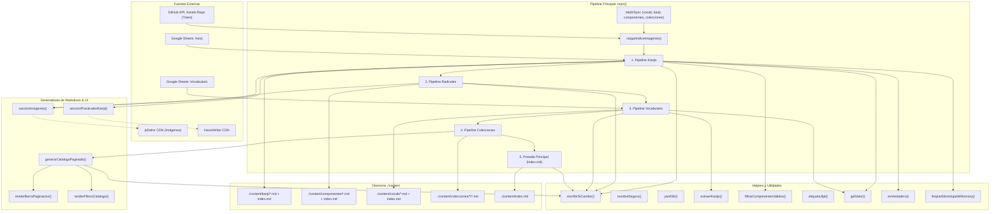

```mermaid
graph TD
    %% Módulos externos y fuentes
    subgraph Fuentes ["Fuentes Externas"]
        CSV_V["Google Sheets: Vocabulario"]
        CSV_K["Google Sheets: Kanji"]
        GH_API["GitHub API: Assets Repo (Trees)"]
        JSDELIVR["jsDelivr CDN (Imágenes)"]
        HZ_CDN["HanziWriter CDN"]
    end

    %% Módulos de Utilidad
    subgraph Utilidades ["Helpers y Utilidades"]
        F_ESC["escribirSiCambio()"]
        F_NOM["nombreSeguro()"]
        F_YAML["yamlStr()"]
        F_KAN["extraerKanjis()"]
        F_COM["filtrarComponentesValidos()"]
        F_JLPT["etiquetaJlpt()"]
        F_VAL["getValor()"]
        F_BOOL["esVerdadero()"]
        F_ETI["limpiarEtimologiaWiktionary()"]
    end

    %% Generadores de UI / Markdown
    subgraph ComponentesUI ["Generadores de Markdown & UI"]
        UI_PAG["renderBarraPaginacion()"]
        UI_FIL["renderFiltrosCatalogo()"]
        UI_QUIZ["seccionPracticadorKanji()"]
        UI_IMG["seccionImagenes()"]
        UI_CAT["generarCatalogoPaginado()"]
    end

    %% Orquestador Principal
    subgraph Orquestador ["Pipeline Principal: main()"]
        P_INIT["mkdirSync (vocab, kanji, componentes, colecciones)"]
        P_IMG["cargarIndiceImagenes()"]
        P_KANJI["1. Pipeline Kanjis"]
        P_RAD["2. Pipeline Radicales"]
        P_VOC["3. Pipeline Vocabulario"]
        P_COL["4. Pipeline Colecciones"]
        P_PORT["5. Portada Principal (index.md)"]
    end

    %% Salidas de Archivos
    subgraph ContenidoGenerado ["Directorio ./content"]
        OUT_K["./content/kanji/*.md + index.md"]
        OUT_C["./content/componentes/*.md + index.md"]
        OUT_V["./content/vocab/*.md + index.md"]
        OUT_COL["./content/colecciones/*/*.md"]
        OUT_IDX["./content/index.md"]
    end

    %% Conexiones
    GH_API --> P_IMG
    CSV_K --> P_KANJI
    CSV_V --> P_VOC

    P_INIT --> P_IMG --> P_KANJI --> P_RAD --> P_VOC --> P_COL --> P_PORT

    P_KANJI --> F_VAL & F_BOOL & F_ETI & F_COM & UI_QUIZ & UI_IMG & F_ESC
    P_RAD --> UI_IMG & F_ESC
    P_VOC --> F_VAL & F_KAN & F_ESC
    P_COL --> UI_CAT
    P_PORT --> F_ESC

    UI_QUIZ -.-> HZ_CDN
    UI_IMG -.-> JSDELIVR
    UI_CAT --> UI_PAG & UI_FIL & F_ESC

    P_KANJI --> OUT_K
    P_RAD --> OUT_C
    P_VOC --> OUT_V
    P_COL --> OUT_COL
    P_PORT --> OUT_IDX
```
